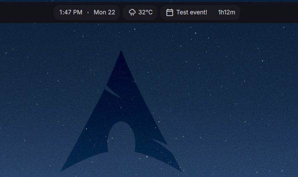

# Dcal Upcoming Event

A [Dank Material Shell](https://danklinux.com/docs/dankmaterialshell) plugin that shows your next calendar event from [dcal](https://github.com/AvengeMedia/dcal) with a live countdown timer.



## Features

- Displays your next upcoming event name and countdown in the dank bar
- Countdown format: `XdYhZm`, skipping zero sections (e.g. `2h15m`, `1d3m`)
- Shows **Now** (in green) for the first 10 minutes of a running event
- Shows `<1m` for events less than a minute away
- Click the widget to toggle the dcal UI

## Settings

| Setting | Description | Range | Default |
|---------|-------------|-------|---------|
| Refresh Interval | How often to fetch events (seconds) | 10 - 120 | 30 |
| Max Width | Maximum width of the event name (pixels) | 80 - 300 | 160 |
| Look-Ahead | How far ahead to look for events (days) | 1 - 7 | 1 |

## Dependencies

- [dcal](https://github.com/AvengeMedia/dcal)
- [jq](https://jqlang.github.io/jq/)

## Installation

Install from the DMS plugin browser, or manually:

```bash
git clone https://github.com/leoamaro01/dms-dcal ~/.config/DankMaterialShell/plugins/dcalUpcoming
```

Then reload plugins from DMS settings or restart the shell.

## License

MIT
